# treebench

This is a benchmarking utility for different tree implementations facing
different use cases. The performance of tree operations can be greatly
affected by how keys are distributed, and some optimizations are not always
possible in certain use case (e.g. hashing if in-order enumeration is needed).

The purpose of the utility provided here is to measure the per-operation cost
for multiple types of keys and distributions.

## Principle

The measured operations are:

* insert(): a new node is inserted into the tree based on its key
* lookup(): a node is looked up in the tree from its key
* delete(): a node is deleted from the tree
* replace(): this is actually insert() + delete(), consisting in replacing a node

At the moment, the benchmark compares 3 tree implementations:

* red-black trees ("rbtree"): these are ubiquitous and generally good for
  multiple purposes though they can be complex and sometimes expensive. The
  storage requires 3 pointers (24 bytes). The implementation used here comes
  from [https://github.com/pvachon/rbtree](https://github.com/pvachon/rbtree).

* elastic binary trees ("ebtree"): these are used in a few projects. They
  consist in a radix tree with O(1) deletion and are generally well suited
  for fast-changing data, at the cost of larger nodes than rbtrees (40 bytes).
  The implementation used here comes from the "stable-6.0" branch of
  [https://github.com/wtarreau/ebtree](https://github.com/wtarreau/ebtree).

* compact elastic binary trees ("cebtree"): this is a compact variant of the
  ebtrees that only requires 2 pointers (like a list). They perform all
  operations in O(log(N)) time, and need to read adjacent nodes to descend,
  which incurs extra memory accesses compared to ebtrees and rbtrees. The
  implementation is the master branch of
  [https://github.com/wtarreau/cebtree](https://github.com/wtarreau/cebtree).

The measures are run at various tree sizes that are configurable. If no size is
specified and no generation method specified, keys are read from the standard
input.

## Results

A script ("run02.sh") runs the tests for various key types at tree sizes 512
to 1048576 entries. When relevant, 3 variants are involved:

* all keys in a single tree
* keys are hashed using XXH3() into 256 tree heads to reduce the tree depth
* keys are hashed using XXH3() into 65536 tree heads to reduce the tree depth

The key models are used:

* timers: keys are 32-bit integers spaced with random positive increments that
  correspond to how entries are inserted in a timer queue (e.g. TCP connections,
  user sessions, etc). There ones require ordered walk and cannot rely on hashes.
  Only insertion and deletion times matter, since the only other operations
  performed in a timer tree are basically first() then a series of next() until
  a non-expired entry is reached. For timers serving as timeouts, most of the
  time the deadline is not reached, meaning that entries are exclusively inserted
  and removed. No hashing is performed here since keys need to be visited in
  order.

* 64-bit hashes: these can correspond do session identifiers or hashes of cached
  objects. The keys are generally well distributed, and there is no relation
  between them (there's no need to visit them in order), meaning that they're
  pretty much suited for hashing. In the case of session identifiers, such keys
  may be looked up often. In the case of a cache, some keys will be looked up
  often while many will only be inserted then retired without ever being looked
  up.

* small strings: this is the same test as the 64-bit hashes, but with the values
  stored as strings instead of integers. This allows to measure the impact of
  short string comparison when used to represent identifiers (e.g. guid, cookies).

* ipv4 addresses: 880k IPv4 addresses of visitors of a public site were shuffled
  in random order and passed to the input instead of generating randoms. The goal
  is to verify the impact of the internet's address imbalance on indexing
  efficiency. Some networks indeed have a lot of clients and others much less.

* user-agents: 46k user agents visiting a public site were shuffled in random
  order and passed to the input as strings instead of generating random strings.
  This allows to see the impact of many highly similar long strings (most of
  them have long identical prefixes and only differ by a component name of version).

Except for the timers, all keys above support hashing and will be hashed into 256
and 65536 buckets.

The test was run on both an Arm v9 machine (Radxa Orion O6) and an x86-64 one
(Xeon w3-2435). The results for the Xeon are presented as graphs below, one
test case per line, and one type of operation per column. Execution times are
measured for each operation (as such, lower values are better). The time to
calculate the hash is included when a hash is used. Each color represents a
tree type. Solid lines indicate no hashing, dashed lines indicate moderate
hashing (256 buckets), dotted lines indicate higher hashing (65536 buckets).

### Timers

|insert|delete|lookup|replace|
|------|------|------|-------|
|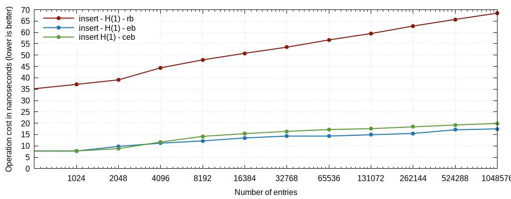|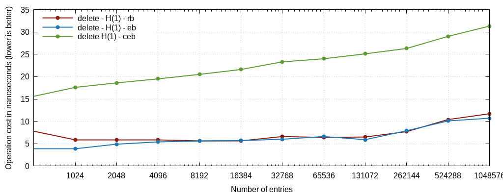|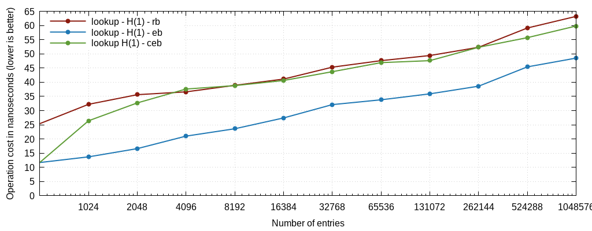|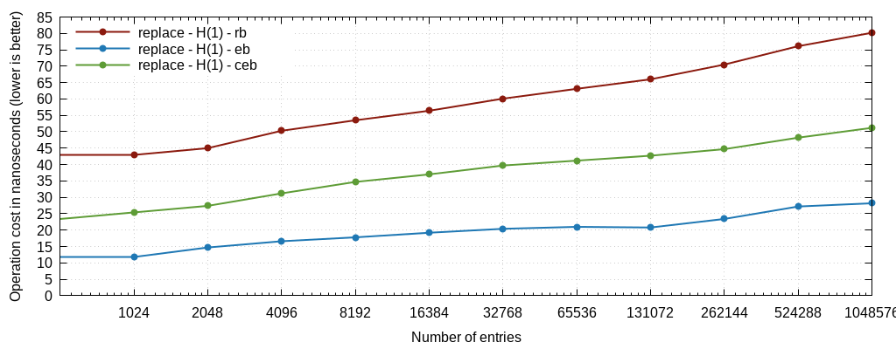|

The most relevant graph here is the "replace" one, counting the cost of both
creating and deleting an entry, which corresponds to what happens during the
lifetime of most such keys. Here ebtrees consume 28ns total at 1M entries, vs
about 80 for rbtrees, showing how they can be relevant to schedulers (where
ebtrees were born). The compact variant lies just between the two and doesn't
make sense to be used here due to its high deletion cost.

### 64-bit hashes

|insert|delete|lookup|replace|
|------|------|------|-------|
|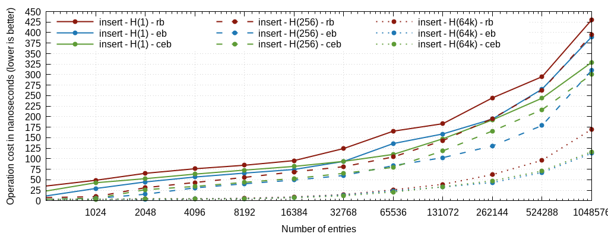|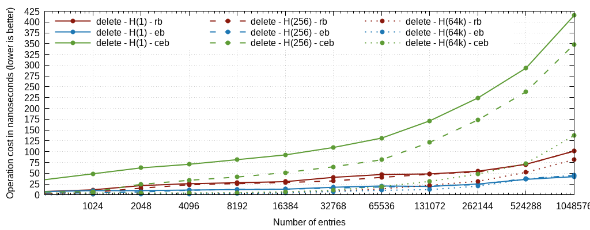|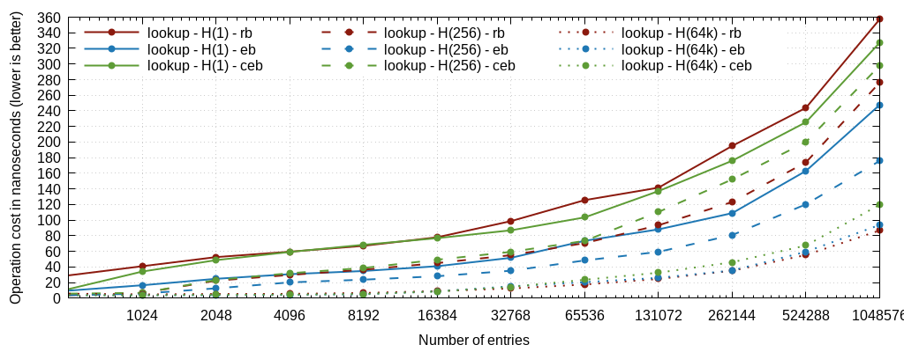|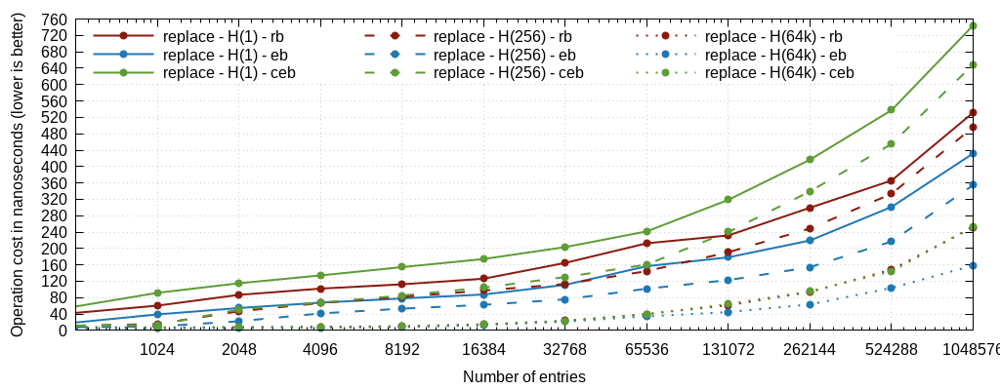|

The key creation+removal is highly in favor of ebtrees here which are about 25%
faster than rbtrees across the whole scale. The lookups are even 35% faster.
However, if often accessed, such keys may benefit from being hashed. Once
hashed to 64k buckets, lookups with rbtrees catch up with ebtrees and even
become slightly faster, though on insert+delete, ebtree still wins, and cebtree
matches rbtree.  This means that for situations where using a large number of
hash buckets is possible, all trees may be interchanged as the real cost
essentially is related to the RAM access time, and the choice is only a matter
of convenience or preference. It's also worth mentioning that cebtrees make
sense for large hash tables instead of lists to better bound depth and resist
to hash attacks.

### short strings

|insert|delete|lookup|replace|
|------|------|------|-------|
|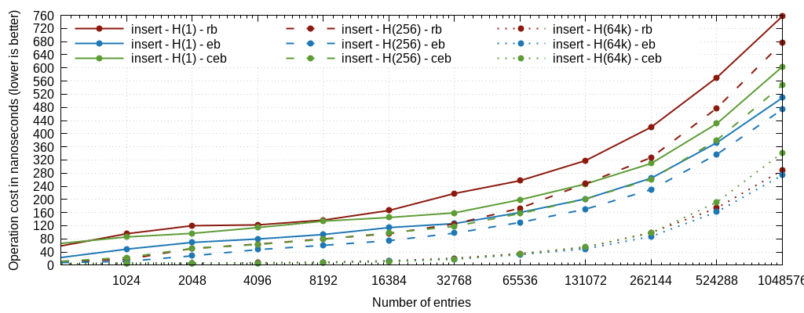|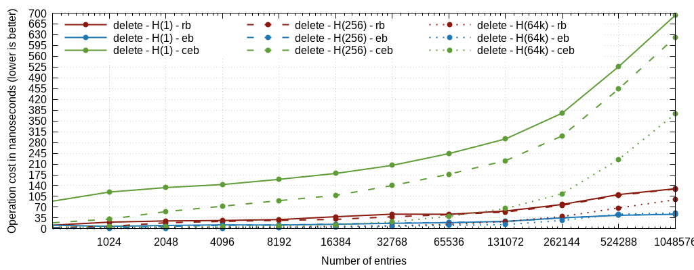|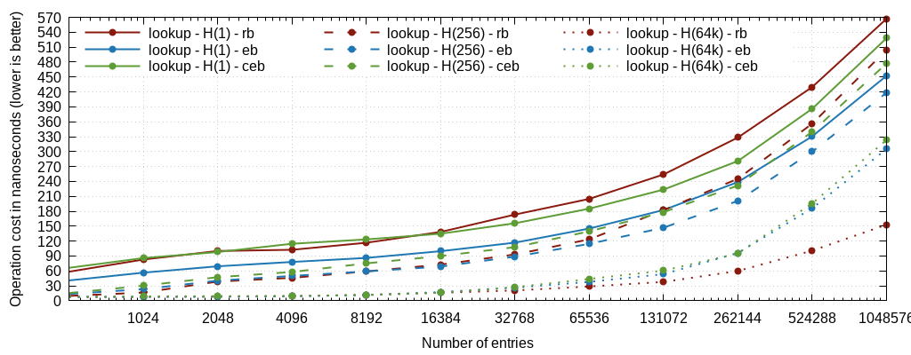|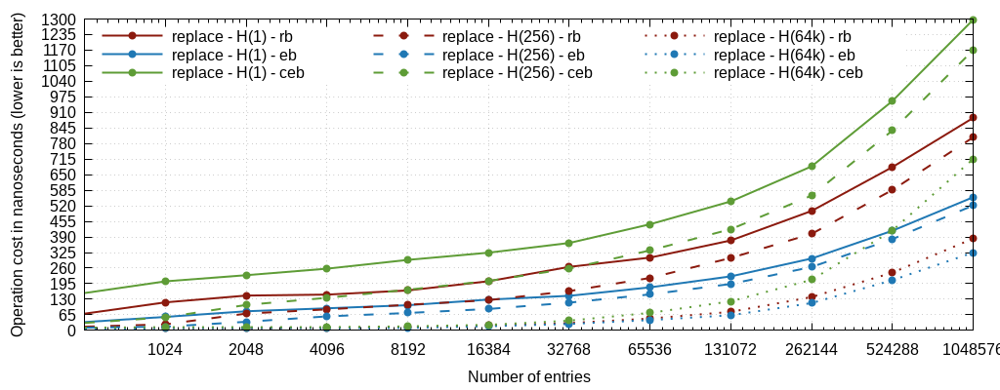|

While ebtree is better than rbtree without hashing, the situation completely
reverses when using a large hash, where rbtree-based lookups can become twice
as fast as ebtree or cebtree (both of which are identical). The most likely
reasons is that comparing short strings can be performed using a few SIMD
instructions using strcmp(), while in ebtree/cebtree, a length prefix is needed
and the strings are compared byte-by-byte.  Creating and deleting entries is
faster on ebtree but the difference fades away with a larger hash. The pure
creation remains better with cebtree than rbtree, which can make it a good
candidate for config-only lookups that are inserted once, looked up a few
times, and never deleted (e.g. object GUIDs or language keywords registered
once at boot).

### real IPv4 addresses

|insert|delete|lookup|replace|
|------|------|------|-------|
|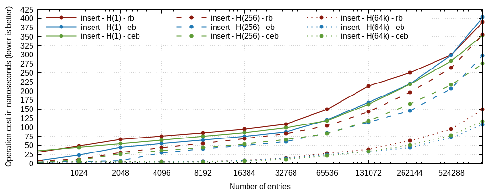|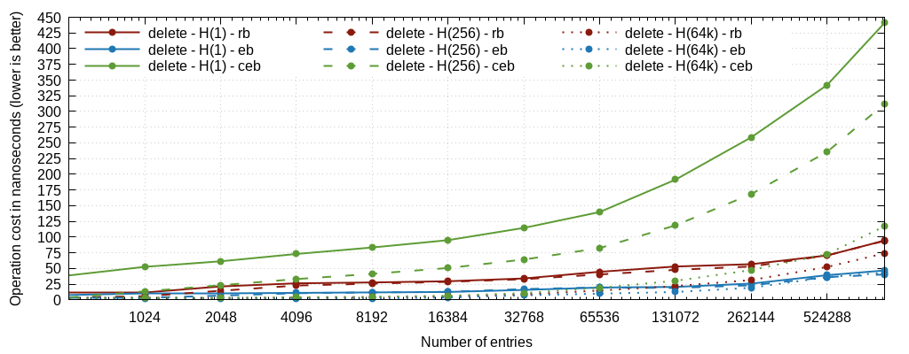|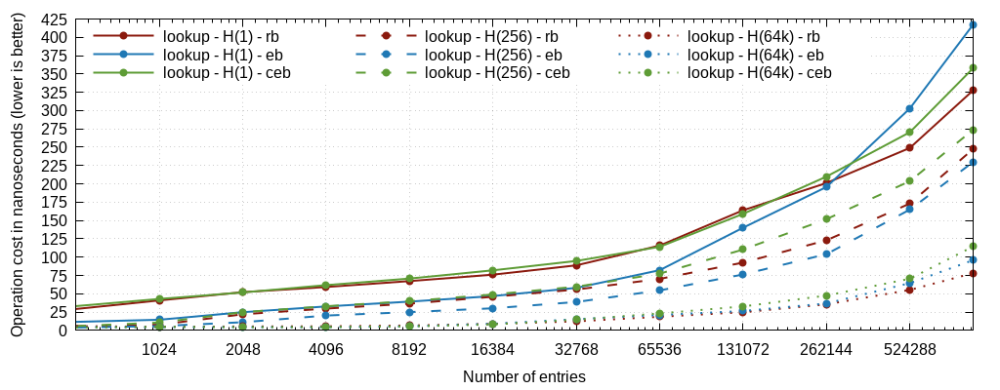|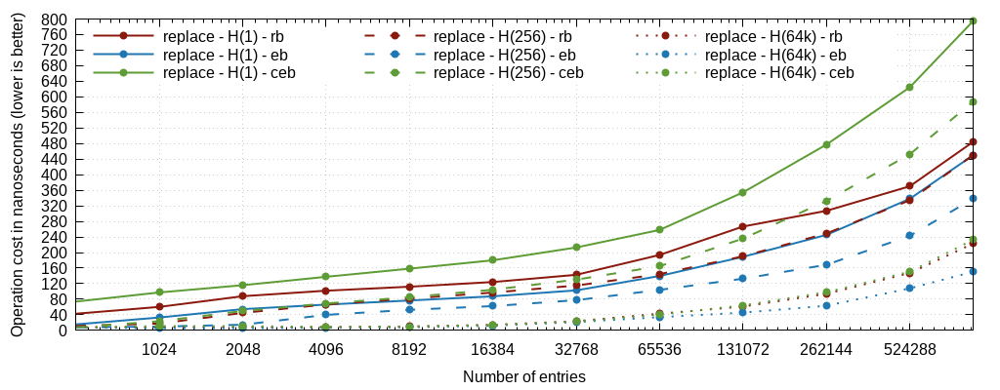|

On exact IP addresses, rbtree is always better on insertion and lookups, thanks
to its ability to correct the imbalanced distribution of the inputs.
Interestingly, as the data set grows, ebtree an even become worse than cebtree,
likely due to the memory bandwidth cost of crossing multiple layers with much
larger nodes.

### real user agents

|insert|delete|lookup|replace|
|------|------|------|-------|
|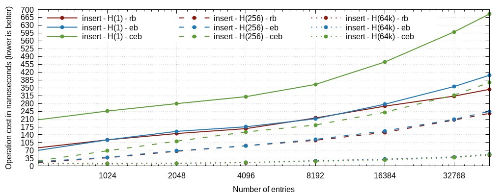|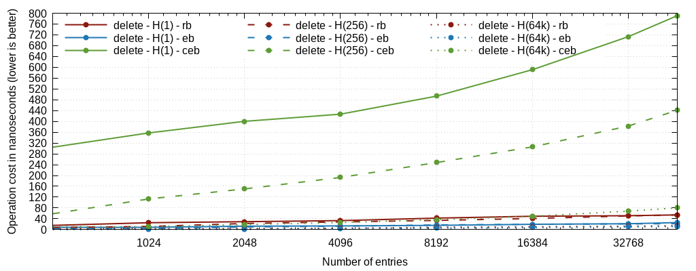|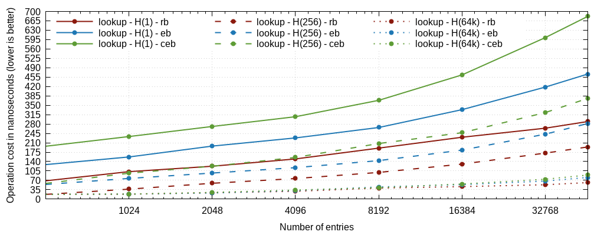|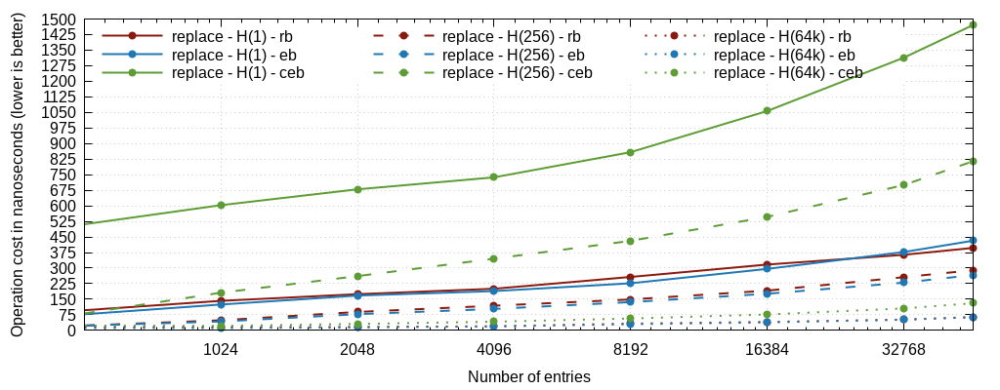|

On larger strings the compact trees are particularly inefficient, as they need
to read the data from the two adjacent nodes, which can each span multiple
cache lines, as is visible in the huge cost of the delete operation. Here
again, the data set is highly imbalanced, which benefit to the rbtrees.

## First conclusions

A few quick conclusions can be drawn from these analysis:

* ebtrees still win by a large margin when it comes to dealing with ordered data
* for keys larger that a cache line (64 bytes), supporting SIMD operations can
  make a big difference, and rbtrees win by a large margin. This is interesing
  by the way because one selling point of radix trees is to avoid comparing bytes
  that had already been compared, but the savings it gives are just not sufficient
  here to offset the imbalance or the byte-at-a-time operations.
* cebtree can make sense for data that's loaded at boot time and never deleted,
  as well as for hash tables of well distributed keys where the size of the node
  may provide a benefit over the other implementations for a similar processing
  cost.
